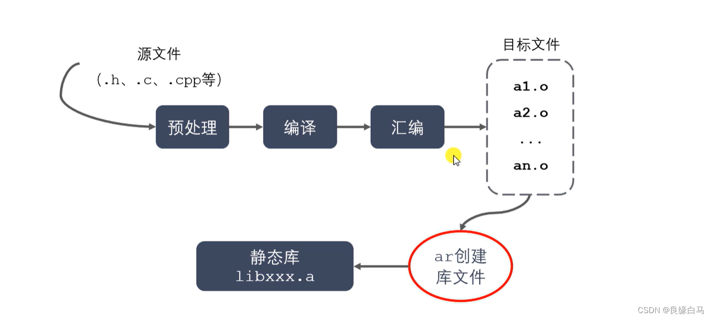
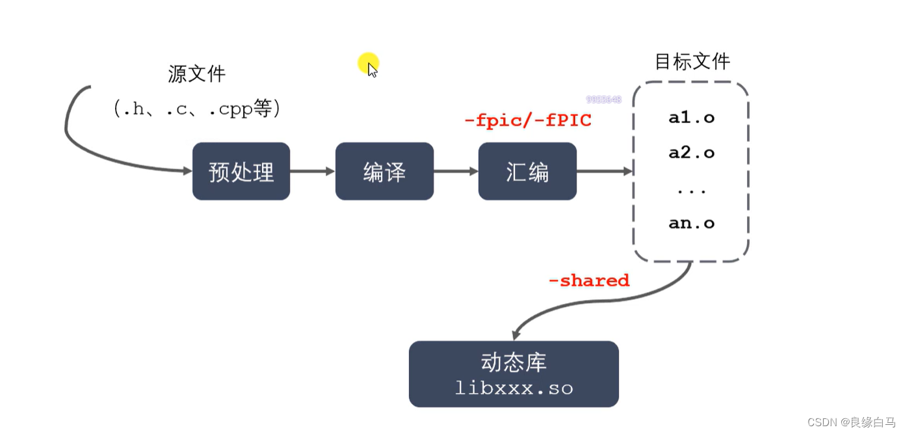

<html>
<style>
    .mac {
        width:10px;
        height:10px;
        border-radius:5px;
        float:left;
        margin:10px 0 0 5px;
    }
    .b1 {
        background:#E0443E;
        margin-left: 10px;
    }
    .b2 { background:#DEA123; }
    .b3 { background:#1AAB29; }
    .warpper{
        background:#121212;
        border-radius:5px;
        width:400px;
    }
</style>
<div class="warpper">
    <div class="mac b1"></div>
    <div class="mac b2"></div>
    <div class="mac b3"></div>
<div>
<br>
</html>

# cmockery单元测试库
通过完成在源代码中给出的运行事例，逐步完善cmockery的仿写

## 运行测试（_run_tests _run_test)
### _run_tests 
在unit_tests中初始化为一个列表，通过遍历列表，完成每个单独的测试

### _run_test
实际运行每一个测试项目的函数，先通过使用c函数中的setjmp确保测试出错后可以
恢复程序的环境  
```c  
default_signal_functions[i] = signal(  
           exception_signals[i], exception_handler);
```
异常处理函数：
处理五种异常：
```cpp
static const int exception_signals[] = {
        SIGFPE,  //浮点异常，例如除以零或溢出。
        SIGILL,  //非法指令，例如执行了未定义或特权的指令。
        SIGSEGV, //段错误，例如访问了无效或受保护的内存地址。
        SIGBUS,  //总线错误，例如对齐错误或物理内存故障。
        SIGSYS,  //无效的系统调用，例如传递了错误的参数或调用了未实现的功能。
};
```


```cpp
#include<iostream>
using namespace std;
int main(){
    return 0;
}
```


# example文件
## run_tests.c
在第一个文件中，调用了comckery中的两个函数：
`         unit_test(null_test_success),
unit_test_with_prefix(someprefix_, null_test_success),`


### 改变
在_run_tests中使用new替代malloc


# 用到的外部知识

## 静态库和动态库
### 静态库和动态库的区别
静态库在程序的链接阶段被复制到了程序中，动态库在链接阶段没有被复制到程序中，而是在程序运行
时由系统动态的加载到内存中提供给程序调用。
* 静态库的好处：编译后不需要其他库函数的支持，可移植性好
* 缺点： 
  1. 如果静态库发生改变，必须重新编译
  2.  相同的库文件可能在内存中加载多份，消耗系统资源
* 动态库优点：
  1. 可实现不同进程间的资源共享
  2. 动态库升级简单，只需要替换库文件，无需重新编译应用程序
  3. 可以控制何时加载动态库，不调用库函数动态库不会被加载
* 动态库缺点：
  1. 加载速度比静态库慢
  2. 发布程序需要提供依赖的动态库


### 创建
#### 静态库制作
1. gcc获得.o文件
2. 将.o文件打包，使用ar工具(archive)  
    `ar rcs libxxx.a xxx.o xxx.o  `  
    r：将文件插入到备存文件中  
    c:建立备存文件  
    s:索引  
   
#### 动态库制作
1. gcc获得.o文件，得到和位置无关的代码  
`gcc -c -fpic/-fPIC a.c b.c`
2. gcc 得到动态库  
`gcc -shared a.o b.o -o libxxx.so`
   
### 使用
